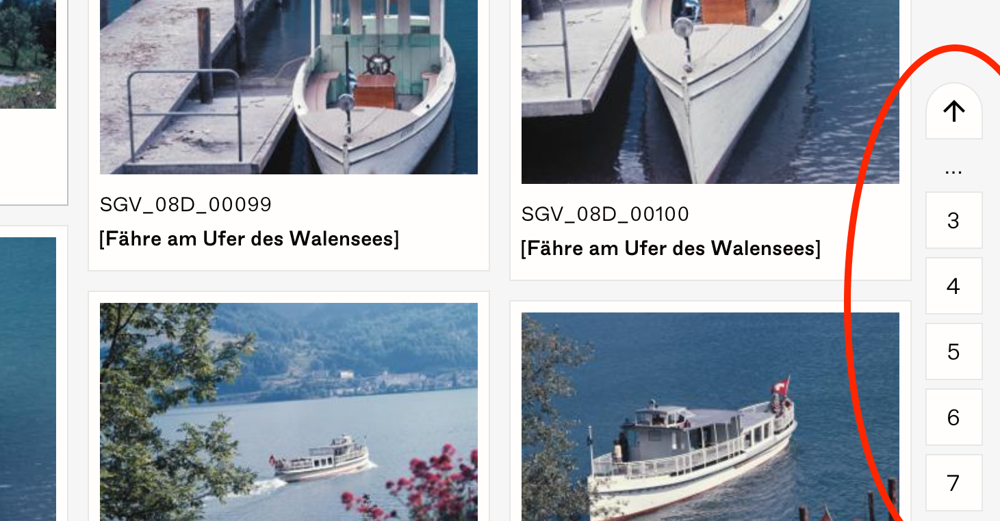
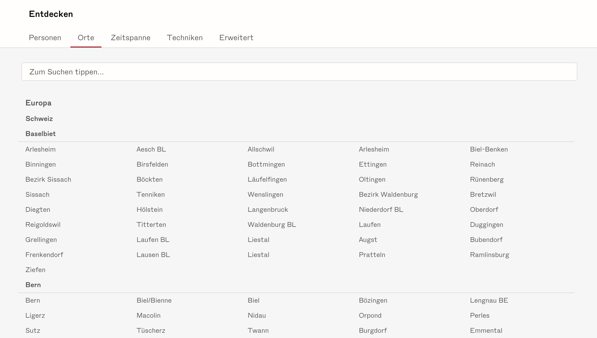

Die Vergangenheit bewahren. Für alle.

Für das Fotoarchiv der Schweizerischen Gesellschaft für Volkskunde (SGV) durften wir ein Front-end entwerfen und umsetzen. Das vorrangige Ziel dabei: Benutzerfreundlichkeit, damit das  Archiv auch wirklich allen offen steht. Das Resultat ist eine Angular-App, die sich durch viel Liebe zum Detail auszeichnet.

<figure>

<figcaption>
Eine Übersichtsdarstellung von Bildern auf einem grossen Bildschirm
</figcaption>
</figure>

Das Fotoarchiv der Schweizerischen Gesellschaft für Volkskunde (SGV) hat in jahrelanger Arbeit alte Sammlungen und Neuschenkungen katalogisiert, restaurieren lassen und mit der Hilfe des [DHLab]() der Universität Basel digitalisiert. Mit unserer App sind nun fast 100'000 Bilder der Öffentlichkeit zugänglich.

<figure>

<figcaption>
Detailansicht eines Bildes auf einem grossen Bildschirm
</figcaption>
</figure>

<figure>

<figcaption>
Detail der innovativen vertikalen Paginierung
</figcaption>
</figure>

<figure>

<figcaption>
Eine filterbare, aber dennoch hierarchische Liste der mit den Bildern verknüpften Orte.
</figcaption>
</figure>
